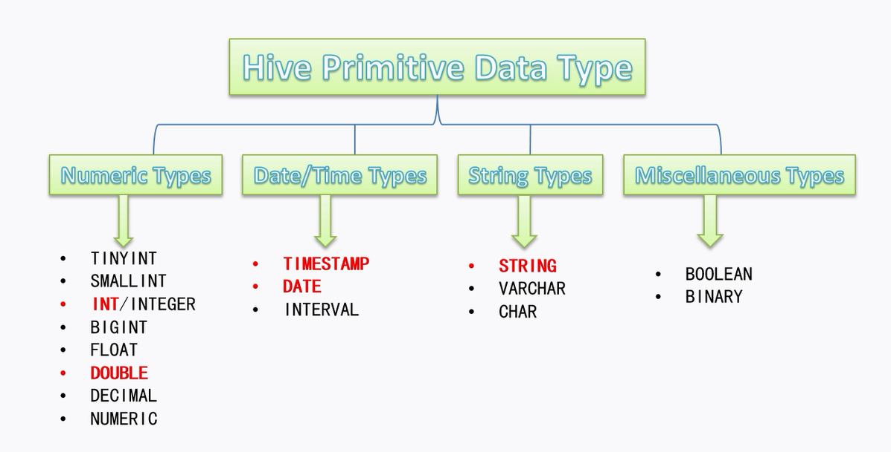
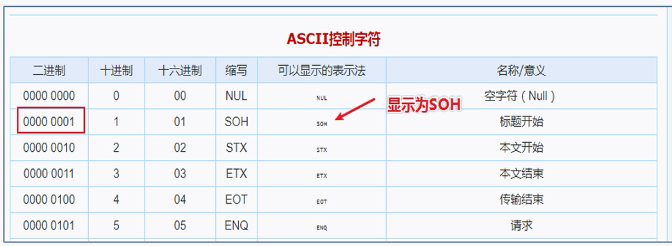

可以使用sublime、VSCode等编辑器进行HQL编写

可以使用idea连接hive进行HQL的编写

### DDL（Data Definition Language 数据定义语言）作用


### 建表语法

[ ]表示可选语法， |表示选其一，顺序需按如下语法树

```hive
CREATE [TEMPORARY] [EXTERNAL] TABLE [IF NOT EXISTS] [db_name.]table_name  [(col_name data_type [COMMENT col_comment], ... ]  [COMMENT table_comment]  [PARTITIONED BY (col_name data_type [COMMENT col_comment], ...)]  [CLUSTERED BY (col_name, col_name, ...) [SORTED BY (col_name [ASC|DESC], ...)] INTO num_buckets BUCKETS]  [ROW FORMAT DELIMITED|SERDE serde_name WITH SERDEPROPERTIES (property_name=property_value,...)]  [STORED AS file_format]  [LOCATION hdfs_path]  [TBLPROPERTIES (property_name=property_value, ...)];
```

```hive
```

### Hive数据类型

分原生数据类型和复杂数据类型


原生数据类型



复杂数据类型


数据类型的隐式转换 原生类型从窄到宽

显示转换 使用 CAST函数

```hive
CAST('内容' as 目标数据类型)，转换失败则返回 NULL
```

### Hive读写文件机制

- SerDe是Serializer、Deserializer的简称，目的是用于序列化和反序列化。
- **序列化是对象转化为字节码的过程**；而反**序列化是字节码转换为对象的过程。**
- Hive使用SerDe（包括FileFormat）读取和写入表行对象。需要注意的是，“key”部分在读取时会被忽略，而在写入时key始终是常数。基本上行**对象存储在value**中。


 Read：

HDFS Files --> InputFileFormat --> <key,value> --> Deserializer --> Row Object

Write:

Row Object --> Serializer --> <key,value> --> OutputFileFormat --> HDFS Files

SerDe相关语法

ROW FORMAT这一行所代表的是跟读写文件、序列化SerDe相关的语法，功能有二：

- 使用哪个SerDe类进行序列化；
- 如何指定分隔符。

```hive
ROW FORMAT DELIMITED| SERDE serde_name WITH SERDEPROPERTIES (property_name=property_value,...)
```


如果没写ROW FORMAT，默认分隔符为 '\001'0




### Hive 指定存储路径

默认路径由${HIVE_HOME}/conof/hive-site.xml文件中的hive.metastore.warehouse.dir属性指定，默认值是：/user/hive/warehouse

语法为 ：LOCATION '<hdfs_location>'
