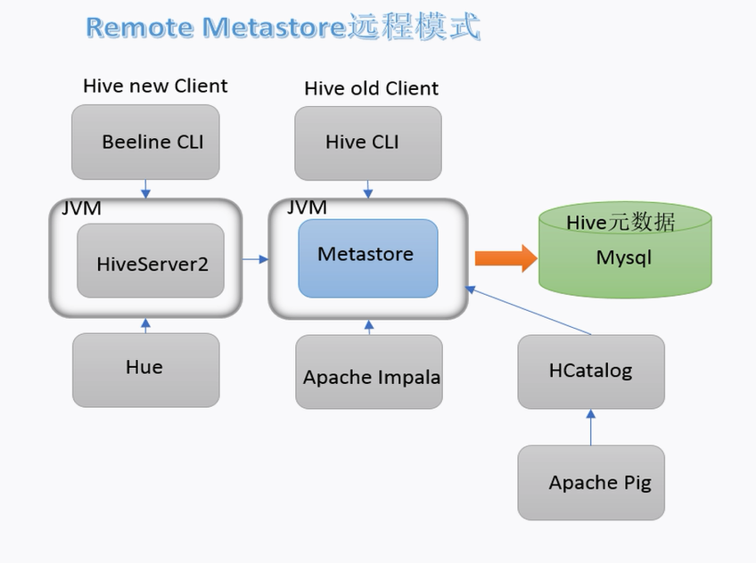
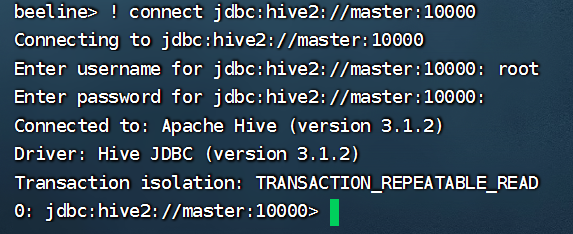
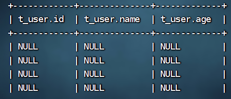
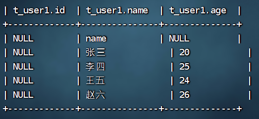
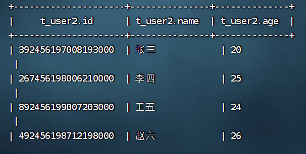
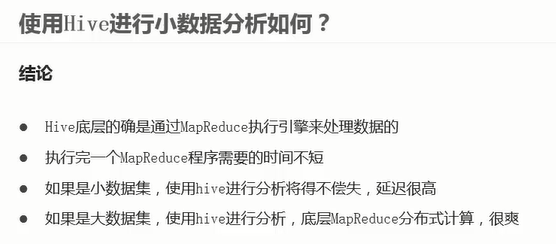

### Hive和Beeline

为了方便以后调用，给hive配置环境变量里

```shell
vi /etc/profile

export HIVE_HOME=/software/hive
export PATH=$PATH:$HIVE_HOME/bin

. /etc/profile # 刷新
```




远程模式下，启动HiveSever2之前必须启动Metastore

在客户端配置hive-site.xml之后，可以访问服务器端的Hive

```xml
<!-- 远程模式部署metastore 服务地址 -->
    <property>
        <name>hive.metastore.uris</name>
        <value>thrift://master:9083</value>
    </property>
```

远程模式下，Beeline不需要在客户端做配置，在服务器端开启Metastore和HiveServer2，开启HiveServer2后要等待一会，后可以直接建立jdbc连接访问

beeline进去后

```sql
! connect jdbc:hive2://master:10000  # 默认端口是10000
```




Hive 用insert + value一条数据都要几十秒，时间成本极高

### Hive映射方式

先准备一张当作容器的表

```hive
create table t_user(id int,name varchar(255),age int);
```

Hive在HDFS上的默认存储路径是user/hive/warehouse/dbname/tablename

Hive映射的方式是将结构化数据文件直接放置在对应HDFS的路径下？

```shell
hadoop fs -cp /hadoop/test/t2.txt /user/hive/warehouse/test02.db/t_user
```

```hive
select * from t_user;
```



结果是能够感知到文件的存在，但不能识别

分隔符的原因？新建一个表测试

```hive
create table t_user1(id int,name varchar(255),age int) row format delimited fields terminated by ',';
```

```shell
hadoop fs -cp /hadoop/test/t2.txt /user/hive/warehouse/test02.db/t_user1
```



发现不对应的部分显示为null，并且会将表头读进

```hive
create table t_user2(id varchar(255),name varchar(255),age int) row format delimited fields terminated by ',' tblproperties ("skip.header.line.count"="1");
```

```shell
hadoop fs -cp /hadoop/test/t2.txt /user/hive/warehouse/test02.db/t_user2
```

成功读表


