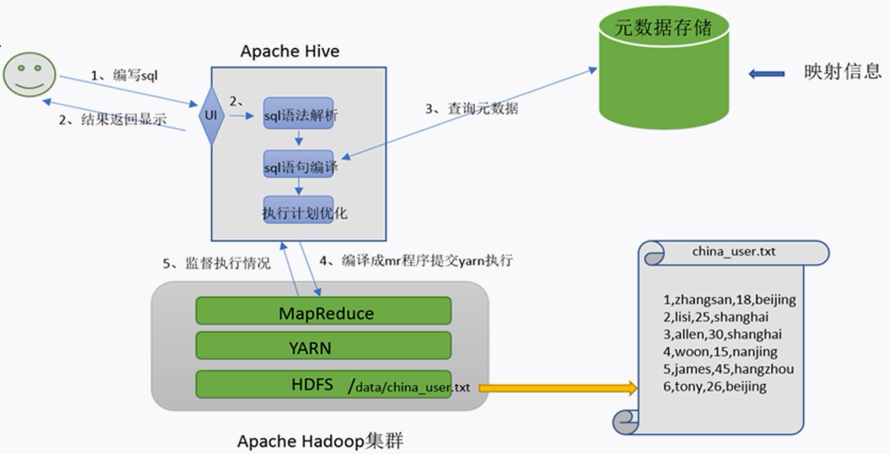
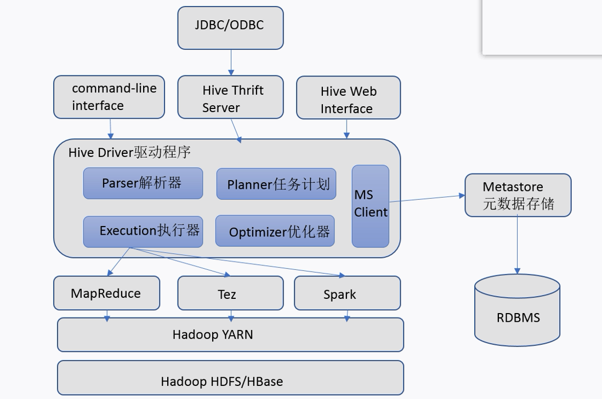
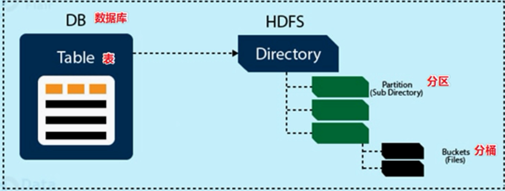
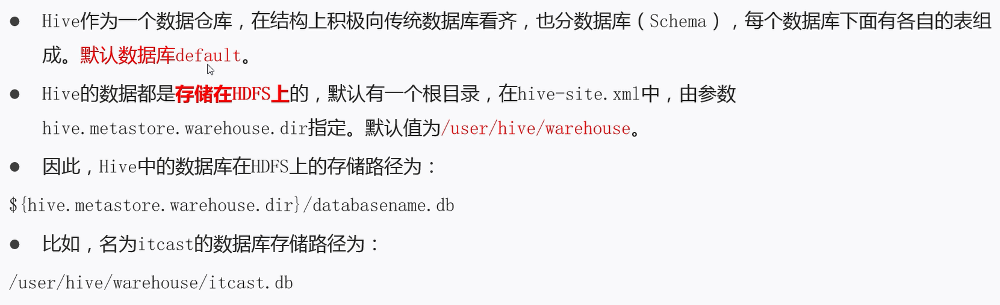
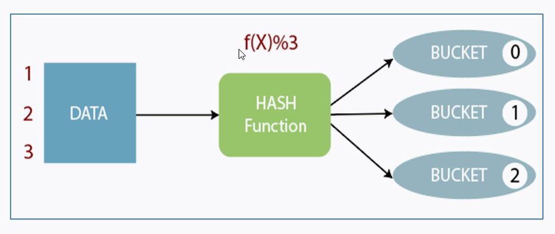
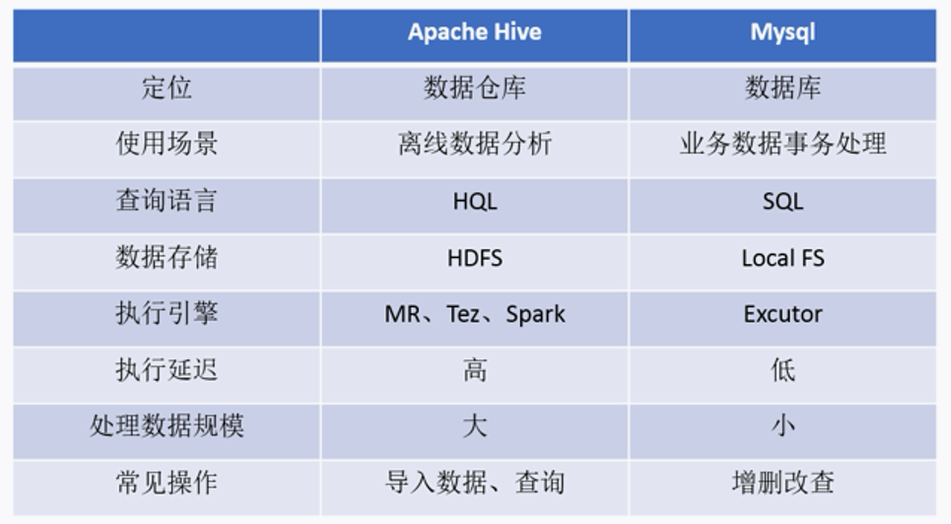

## 什么是Hive？

- Hive是一款建立在Hadoop之上的开源**数据仓库**系统，可以将存储在Hadoop文件中的结构化、**半结构化数据文件映射为为一张数据库表**，基于表提供了一种类似SQL的查询模型，成为**Hive查询语言（HQL）**，用于访问和分析存储在Hadoop文件中的大幸数据集。
- Hive核心是将**HQL转换为MapReduce程序**，然后将程序提交到Hadoop集群执行

## 为什么使用Hive？

- 操作接口采用类SQL语法，提供快速开发的能力(简单、容易上手)
- 避免直接写MapReduce，减少开发人员的学习成本
- 支持自定义函数，功能扩展很方便
- 背靠Hadoop，擅长存储分析海量数据集

## Hive和Hadoop的关系

数据仓库需要具备两种能力

- 存储出数据的能力
- 分析数据的能力

**Hive利用HDFS存储数据，利用MapReduce查询分析数据，用户专注于编写HQL,Hive将其转换成为MapReduce程序完成对数据的分析**

## Hive功能实现机制

- Hive将（半）结构化的文件映射成一张表，需要将**文件和表之间的对应关系**描述记录清楚，映射信息被称为**元数据信息**
- 用户写完SQL之后Hive需要针对SQL进行语法校验，并且根据记录的元数据信息解读SQL背后的含义，制定执行计划。并且把执行计划转换成MapReduce程序来执行，把执行的结果封装返回给用户 （**SQL语法解析，编译**为MapReduce程序）

## Hive架构、组件

### 用户接口

- CLI（Command-Line Interface）：shell命令行
- JDBC/ODBC：通过Thrift服务器允许外部客户端通过网络与Hive进行交互
- WebGUI：通过浏览器访问 

### Driver驱动程序

包括语法解析器、计划编译器、优化器、执行器

### 执行引擎

通过执行引擎处理数据文件，支持MR、Tez、Spark

## Hive数据模型

- 数据模型:用来描述数据、组织数据和对数据进行操作，是对现实世界数据特征的描述
- Hive的数据模型**类似于RDBMS库表结构**，此外**还有自己特有模型**
- Hive中的数据可以在粒度级别上分为三类：Table 表、Partition 分区、Bucket 分桶

### 数据库db

Hive数据存储在HDFS上，在hive-site.xml中配置hive.metastore.warehouse.dir

Hive中的数据库存储路径即${hive.metastore.warehouse.dir}/databasename.db

### Tables 表

Hive表与关系数据库中的表相同。Hive中的表所对应的数据通常是存储在HDFS中，而表相关的元数据是存储在RDBMS中。

存储路径为

${hive.metastore.warehouse.dir}/databasename.db/tablename

### Partitions 分区

一种优化手段，根据分区列的值将表华为不同分区，存储形式上是table目录下的子文件夹，**一个文件夹表示一个分区**。子文件夹命名标准：分区列=分区值。可以分区下继续分区

### Buckets 分桶

## Hive和SQL对比

