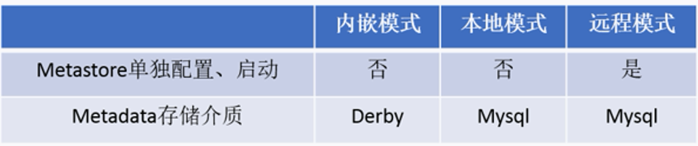
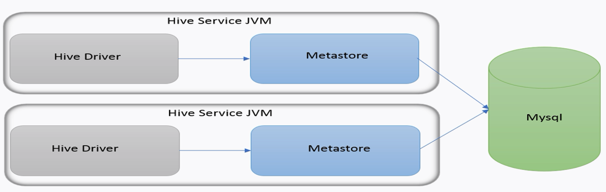
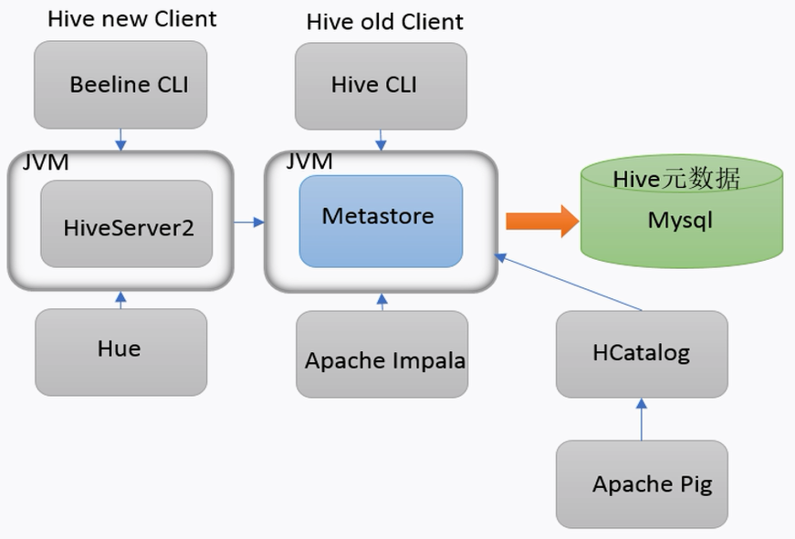
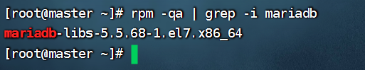
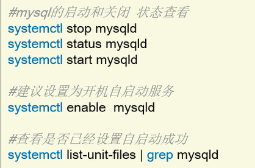

## 前置理解

### 元数据（metadata）

描述数据的数据，主要描述数据的属性


Metastore元数据服务，管理metadata元数据

### Metastore配置方式

内嵌模式、本地模式、远程模式



#### 内嵌模式（Embedded Metastore）

Metastore的默认部署模式，元数据存储在内置的Derby数据库，Derby和Metastore都嵌入在主HiveServer进程中，启动HiveServer进程时，都会一起启动

一次只能支持一个活动用户，只用于测试体验，不适用于生产环境

#### 本地模式（Local Metastore）

本地模式采用**外部数据库来存储元数据**，推荐MySQL，hive根据hive.metastore.uris参数值判断，为空则为本地模式

没启动一次Hive,都会内置一个Metastore



#### 远程模式（Remote Metastore）

远程模式下，Metastore服务在自己的单独JVM中运行，其他进程与之通信可以使用Thrift Network API

需要配置hive.metastore.uris参数来指定Metastore服务运行的机器IP和端口，并且**需要手动启动**Metastore服务，元数据与采用外部数据库来存储，如MySQL

在生产环境中，建议用远程模式来配置Hive Metastore。在这种情况下，其他依赖hive的软件都可以通过Metastore访问hive。由于还可以完全屏蔽数据库层，因此这也带来了更好的可管理性/安全性。



## Hive部署

### 安装前准备

- 服务器基础环境（防火墙关闭、host映射、免密登入等）
- Hadoop集群健康可用（需等待HDFS安全模式关闭之后在启动运行Hive）         

Hive不是分布式软件，不需要每个节点都安装，通过Hadoop来实现分布式特性。

#### Hadoop与Hive整合

修改Hadoop中的core-site.xml

cd /software/hadoop/etc/hadoop

vi core-site.xml

```xml
<!--整合Hive 代理用户配置-->
<propertity>
	<name>hadoop.proxyuser.root.hosts</name>
    <value>*</value>
</propertity>
<propertity>
	<name>hadoop.proxyuser.root.groups</name>
    <value>*</value>
</propertity>
```

```shell
# 分发
scp -r core-site.xml root@slave1:$PWD
scp -r core-site.xml root@slave2:$PWD
```

重启Hadoop集群

### 安装

#### 内嵌模式


1、安装包上传到/data/packages, 直接解压安装

```shell
tar -zxvf apache-hive-3.1.2-bin.tar.gz -C /software/
mv /software/apache-hive-3.1.2-bin/ /software/hive
```

2、解决Hadoop、Hive之间Guava版本差异

（Guava是几乎在所有Java语言开发的项目中都会用的三方库）

```shell
cd /software/hive
rm -rf lib/guava-19.0.jar 
cp /software/hadoop/share/hadoop/common/lib/guava-27.0-jre.jar ./lib/
```

3、修改hive环境变量文件 添加HADOOP_HOME

```shell
cd /software/hive/conf/
mv hive-env.sh.template  hive-env.sh
vi hive-env.sh 

export HADOOP_HOME=/software/hadoop
export HIVE_CONF_DIR=/software/hive/conf
export HIVE_AUX_JARS_PATH=/software/hive/lib
```

4、初始化metadata

```shell
cd /software/hive/bin
./schematool -dbType derby -initSchema
```

5、启动Hive

```shell
./hive
```

内嵌模式下，在哪个路径下进行初始化，元数据就存储在哪，数据之间不能交互。

#### 本地模式

1、安装MySQL

```shell
# 先卸载CetOS7自带的mariadb
rpm -qa | grep -i mariadb
rpm -e mariadb-libs-5.5.68-1.el7.x86_64 --nodeps
```



```shell
# 将安装包上传到/data/packages中
mkdir /software/mysql
tar -xvf /data/packages/mysql-5.7.29-1.el7.x86_64.rpm-bundle.tar -C /software/mysql

# 执行安装
yum -y install libaio
rpm -ivh --nodeps mysql-community-common-5.7.29-1.el7.x86_64.rpm mysql-community-libs-5.7.29-1.el7.x86_64.rpm mysql-community-client-5.7.29-1.el7.x86_64.rpm mysql-community-server-5.7.29-1.el7.x86_64.rpm

# 初始化
mysqld --initialize
# 更改所属组
chown mysql:mysql /var/lib/mysql -R

# 启动MySQL
systemctl start mysqld.service
# 查看生成的随机密码
cat /var/log/mysqld.log
# [Note] A temporary password is generated for root@localhost: e#3=qD7,agg9

# 修改MySQL root密码，授权远程访问
mysql -u root -p
```

```mysql
alter user user() identified by "1234"; # 更新密码为1234
# 授权
use mysql;
GRANT ALL PRIVILEGES ON *.* TO 'root'@'%' IDENTIFIED BY '1234' WITH GRANT OPTION;
FLUSH PRIVILEGES;
```



2、Hive安装

在前面内嵌的基础上

```shell
# 解压安装
# 解决guava版本差异
# 新增！添加MySQL JDBC驱动到Hive的lib目录下
# 修改Hive环境变量文件hive-env.sh
# 新增！修改hive-site.xml
```

```xml
<configuration>
    <!-- 存储元数据mysql相关配置 -->
    <property>
        <name>javax.jdo.option.ConnectionURL</name>
        <value> jdbc:mysql://master:3306/hive?createDatabaseIfNotExist=true&amp;useSSL=false&amp;useUnicode=true&amp;characterEncoding=UTF-8</value>
    </property>

    <property>
        <name>javax.jdo.option.ConnectionDriverName</name>
        <value>com.mysql.jdbc.Driver</value>
    </property>

    <property>
        <name>javax.jdo.option.ConnectionUserName</name>
        <value>root</value>
    </property>

    <property>
        <name>javax.jdo.option.ConnectionPassword</name>
        <value>1234</value>
    </property>

    <!-- 关闭元数据存储授权  -->
    <property>
        <name>hive.metastore.event.db.notification.api.auth</name>
        <value>false</value>
    </property>

    <!-- 关闭元数据存储版本的验证 -->
    <property>
        <name>hive.metastore.schema.verification</name>
        <value>false</value>
    </property>
</configuration>
```

```shell
# 初始化metadata
/software/hive/bin/schematool -initSchema -dbType mysql -verbos
# 启动hive
# 不同路径下启动的hive数据相同
```

#### 远程模式（重要）

hive-site.xml修改

```xml
<configuration>
    <!-- 存储元数据mysql相关配置 -->
    <property>
        <name>javax.jdo.option.ConnectionURL</name>
        <value> jdbc:mysql://master:3306/hive?createDatabaseIfNotExist=true&amp;useSSL=false&amp;useUnicode=true&amp;characterEncoding=UTF-8</value>
    </property>

    <property>
        <name>javax.jdo.option.ConnectionDriverName</name>
        <value>com.mysql.jdbc.Driver</value>
    </property>

    <property>
        <name>javax.jdo.option.ConnectionUserName</name>
        <value>root</value>
    </property>

    <property>
        <name>javax.jdo.option.ConnectionPassword</name>
        <value>1234</value>
    </property>

    <!-- H2S运行绑定host -->
    <property>
        <name>hive.server2.thrift.bind.host</name>
        <value>master</value>
    </property>

    <!-- 远程模式部署metastore 服务地址 -->
    <property>
        <name>hive.metastore.uris</name>
        <value>thrift://master:9083</value>
    </property>

    <!-- 关闭元数据存储授权  -->
    <property>
        <name>hive.metastore.event.db.notification.api.auth</name>
        <value>false</value>
    </property>

    <!-- 关闭元数据存储版本的验证 -->
    <property>
        <name>hive.metastore.schema.verification</name>
        <value>false</value>
    </property>
</configuration>
```

```shell
# 初始化metadata
/software/hive/bin/schematool -initSchema -dbType mysql -verbos
# 现在直接启动Hive运行指令会报错，远程模式下需要手动启动Metastore
# 1、前台启动
/software/hive/bin/hive --service metastore
# 2、后台启动 进程挂起，后台关闭
nohup /software/hive/bin/hive --service metastore &

#前台启动开启debug日志
/software/hive/bin/hive --service metastore --hiveconf hive.root.logger=DEBUG,console

```


