## 数据仓库为何而来？

为了分析数据而来，分析结果给企业决策提供支持

1. 操作性记录的保存
2. 分析型决策的制定

OLTP（联机事务处理系统），基本特征是前台接受的用户数据可以立即传送到后台进行处理，并在很短的时间内给出处理结果。

关系型数据库（RDBMS）是OLTP的典型应用，比如Oracle，MySQL，SQL Server等

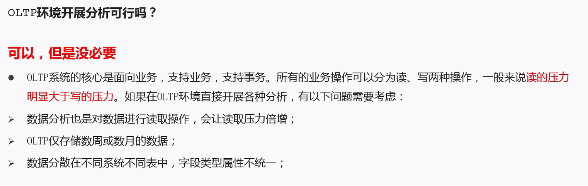

- 当分析所涉及数据规模较小的时候，在业务低峰期时可以在OLTP系统上开展直接分析。但是**为了更好的进行各种规模的数据分析，同时也不影响OLTP系统运行，此时需要构建一个集成统一的数据分析平台**
- 该平台的目的很简单:**面向分析，支持分析**，并且和OLTP系统解耦合。
- 基于这种需求，数据仓库的雅形开始在企业中出现了

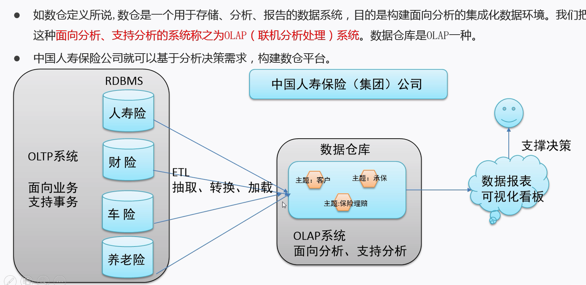

如数仓定义所说,数仓是一个用于存储、分析、报告的数据系统，目的是构建面向分析的集成化数据环境。我们把这种**面向分析、支持分析的系统称之为OLAP( 联机分析处理）系统**。数据仓库是OLAP一种

## 主要特征

1、面向主题性（Subject-Orient）

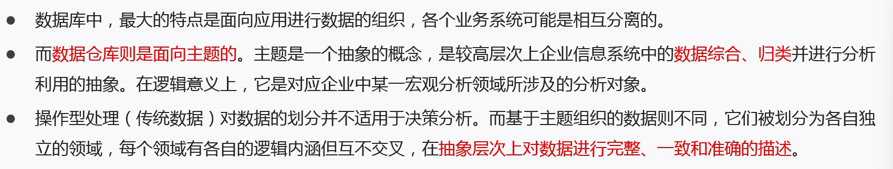

2、集成性（Integrated）

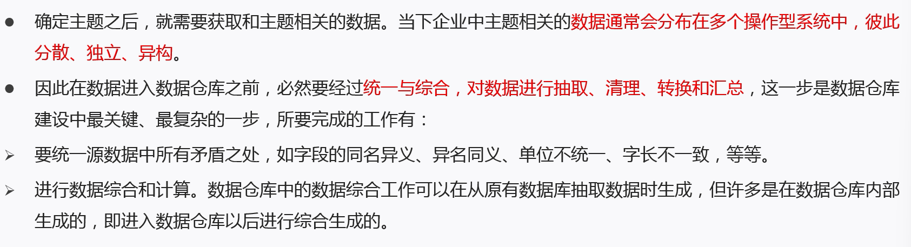

3、非易失性、非异变性（Non-Volatile）

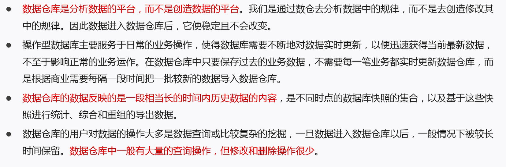

4、时变性（Time-Variant）

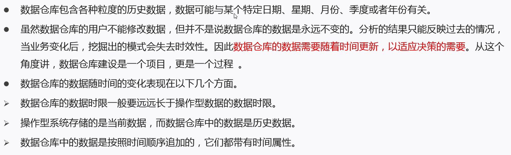

## OLTP（On-Line Transaction Processing）

联机事务处理

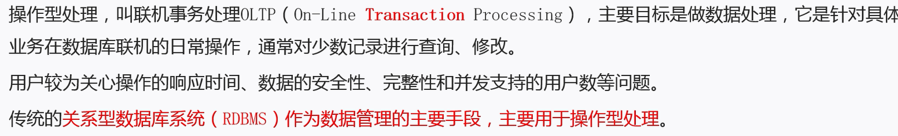

## OLAP（On-Line Analytical Processing）

联机分析处理

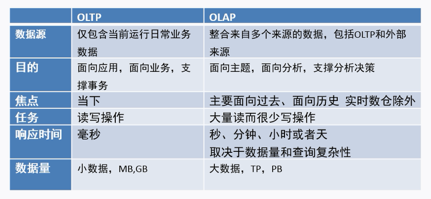

## 数据仓库和数据库

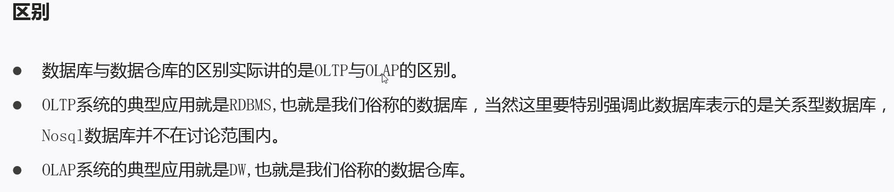

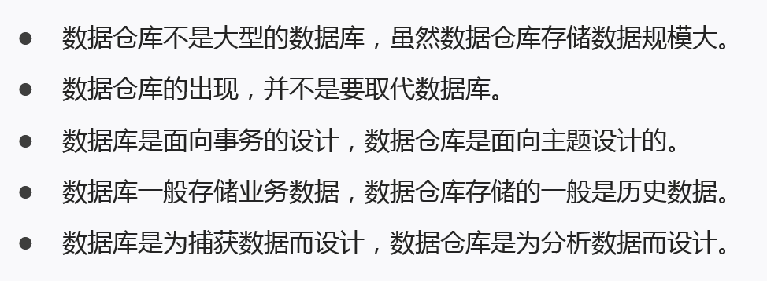

## 数据仓库和数据集市

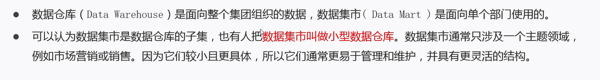

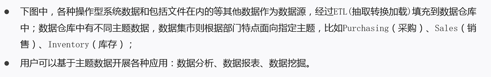

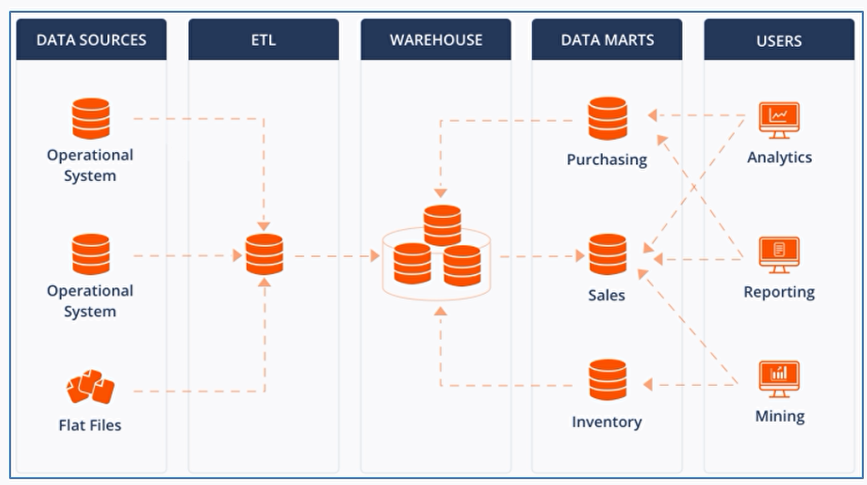

## 数据仓库分层架构

1. 操作性数据层（ODS）
2. 数据仓库层（DW）
3. 数据应用层（DA）

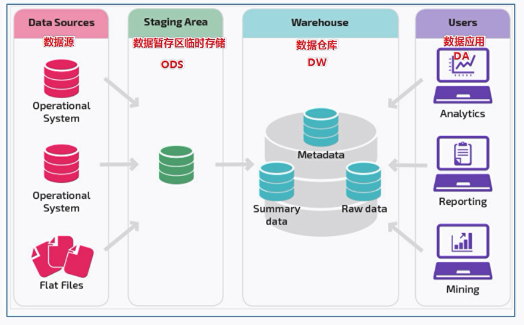

ODS层（Operation Data Store）

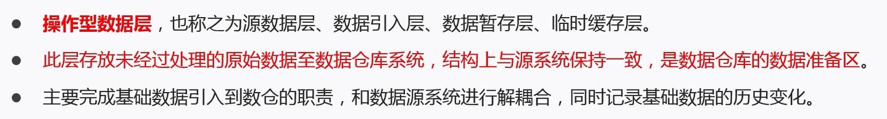

DW层（Data Warehouse）

- 公共维度层 DIM
- 公共汇总粒度事实层 DWS、DWB
- 明细粒度事实层 DWD

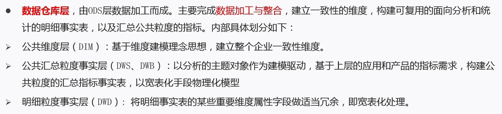

DA层（或ADS层）

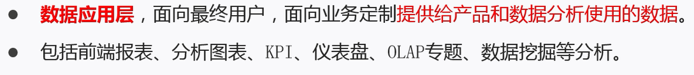

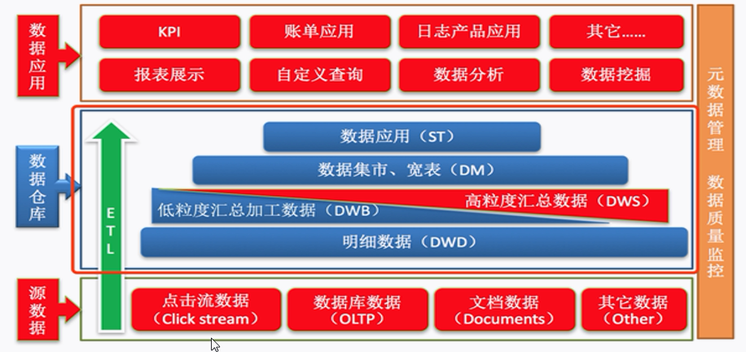

分层架构的好处

- 清晰数据结构
- 数据血缘追踪
- 减少重复开发
- 复杂问题简单化
- 屏蔽原始数据的异常

## ETL和ELT的区别

E（Extra抽取）T（Transfer转换）L（Load转载）

从个数据源获取数据及在数据仓库内的数据转换和流动都可以被认为是ETL

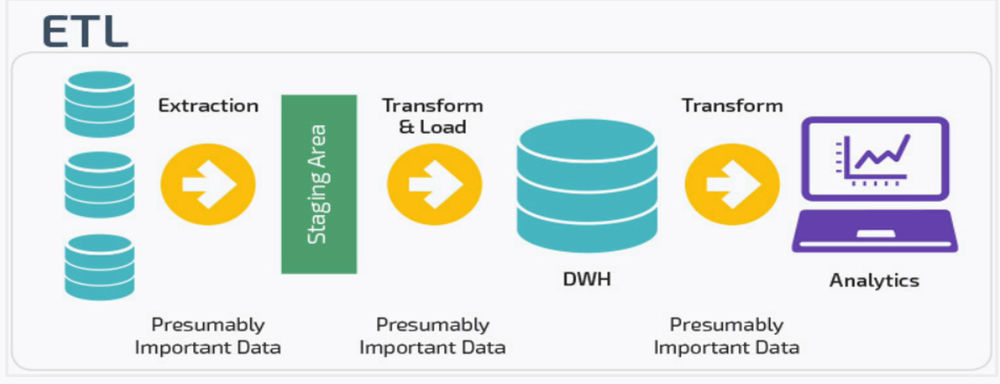

传统数据仓库便是将数据暂存到ODS层，然后进行转换得到目标格式的数据仓库，最后去读取，即ETL过程

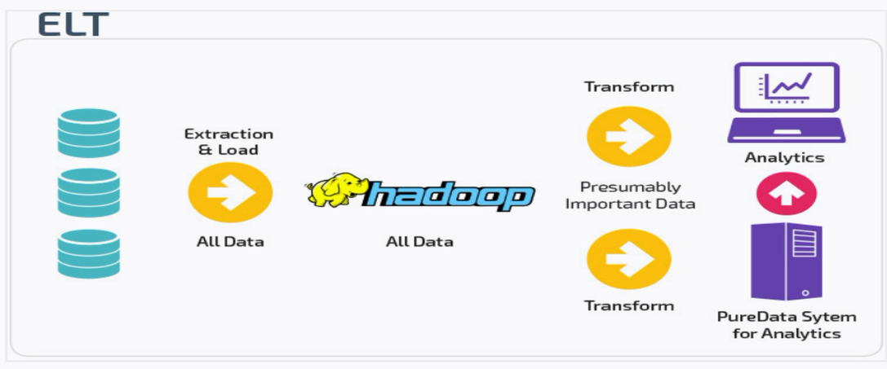

大数据时代，数去抽取后可能不会有专门的临时数据库ODS，直接加载到集中存储库中，在存储库中根据不同的业务需求进行不同的转换，以便与BI工具一起使用。

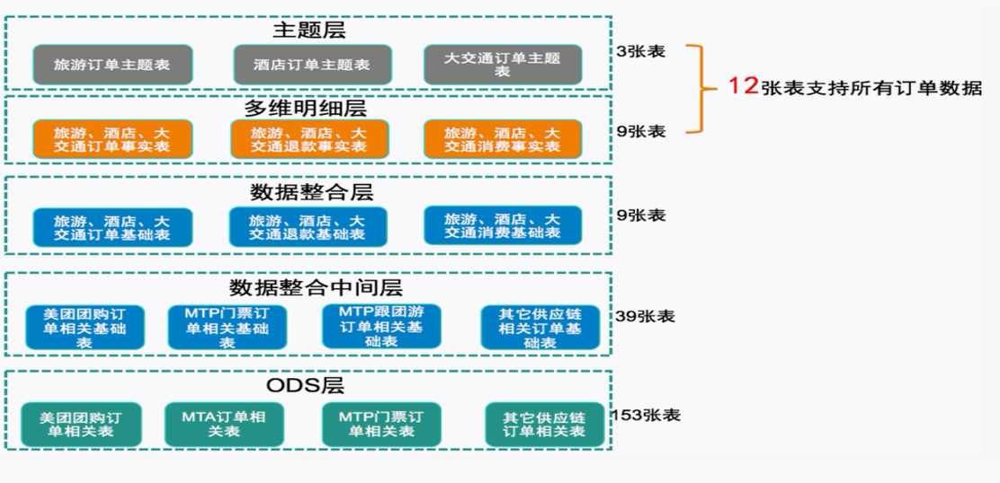