## Kettle整合大数据平台

### 整合Hadoop

1. 确保Hadoop的环境变量设置好HADOOP_USER_NAME为root

```shell
vi /etc/profile

HADOOP_USER_NAME=root
```

2. 从hadoop下载核心配置文件

   /software/hadoop/etc/hadoop/目录下的

   hdfs-site.xml和core-site.xml

3. 把hadoop核心配置文件(hdfs-site.xml和core-site.xml)放入kettle目录

```shell
data-integration\plugins\pentaho-big-data-plugin\hadoop-configurations\hdp30
```

4. 修改 `data-integration\plugins\pentaho-big-data-plugin\plugin.properties`文件

- 修改plugin.properties

```properties
active.hadoop.configuration=hdp30
```

### 整合Hive

1、从虚拟机下载Hadoop的jar包

/software/hadoop/share/hadoop/common/

2、把jar包放在\data-integration\lib目录下，xml文件放到hdp30下


重启生效


#### 从hive中读取数据

- hive数据库是通过jdbc来进行连接，可以通过表输入控件来获取数据。

需求：

- 从hive数据库的test库的a表中获取数据，并把数据保存到Excel中。

实现步骤：

1、设计一下kettle组件结构

选择输入文件夹内的表输入组件：

| 表输入组件                                                   |
| ------------------------------------------------------------ |
| 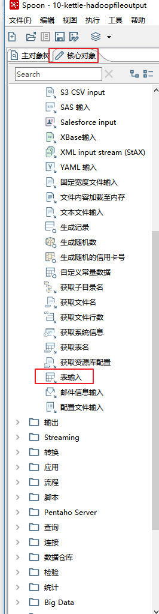  |
| 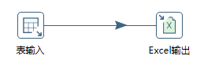 |


2、配置表输入组件

| 新建hivejdbc连接：                                          |
| ----------------------------------------------------------- |
| 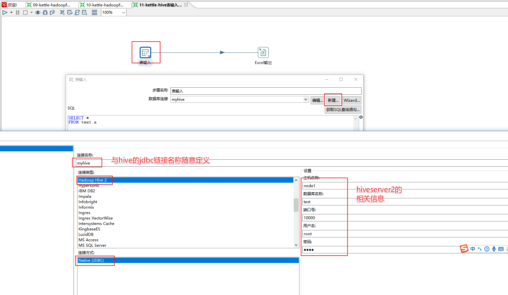 |
| 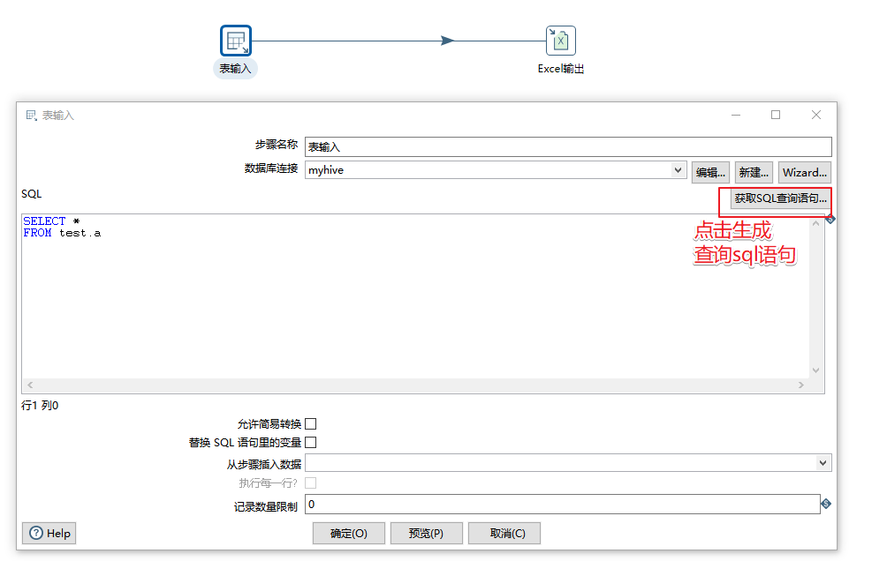 |
| 配置excel输出组件                                           |
| 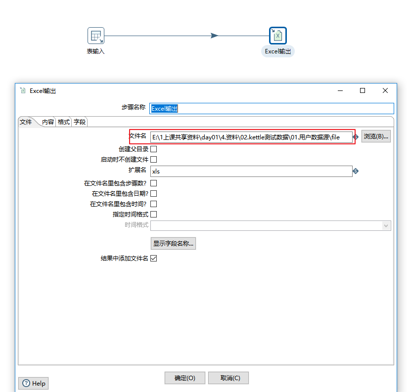 |
| 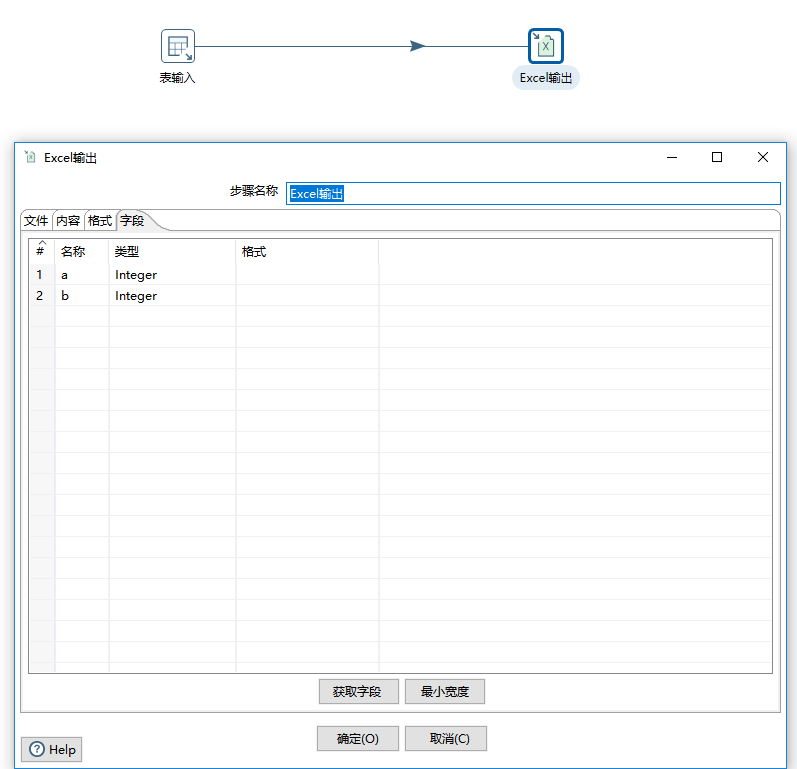 |


#### 把数据保存到hive数据库

hive数据库是通过jdbc来进行连接，可以通过表输出控件来保存数据。

需求：

- 从Excel资料\02.kettle测试数据\01.用户数据源\file_user.xls中读取数据，把数据保存在hive数据库的test数据库的t_user表。

实现步骤：

1、设计如下kettle组件结构

| 组件配置图                                                   |
| ------------------------------------------------------------ |
|  |


2、配置 Excel输入组件

| excele输入组件                                              |
| ----------------------------------------------------------- |
| 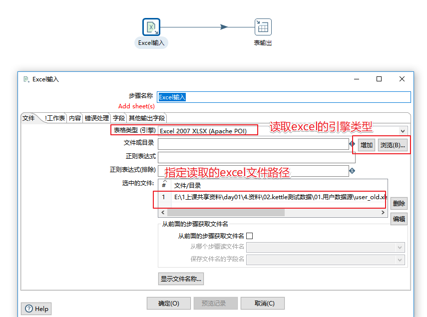 |
| 查看excel解析字段是否正确                                   |
| 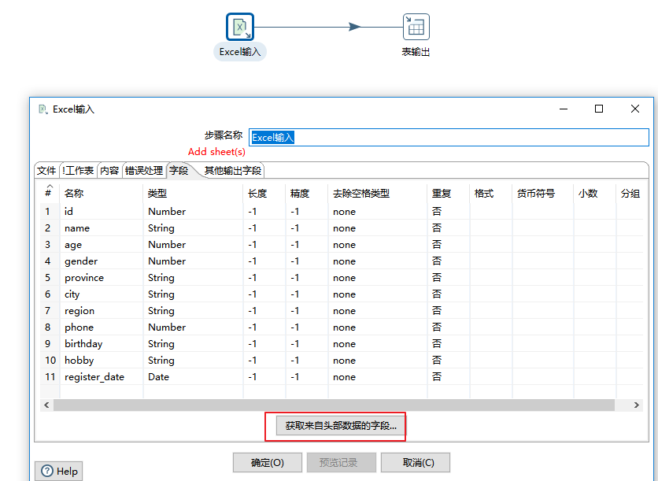 |


2、配置表输出组件

| 表输出组件                                                  |
| ----------------------------------------------------------- |
| 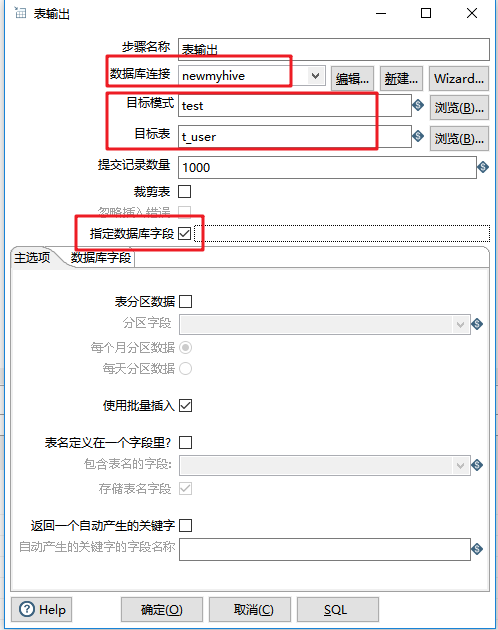 |
| 获取流中的字段                                              |
| 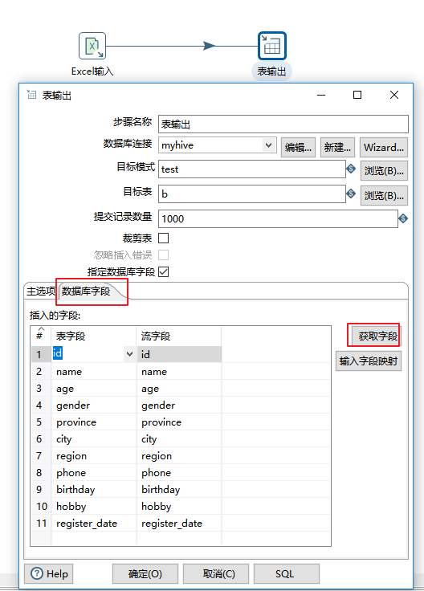 |
| 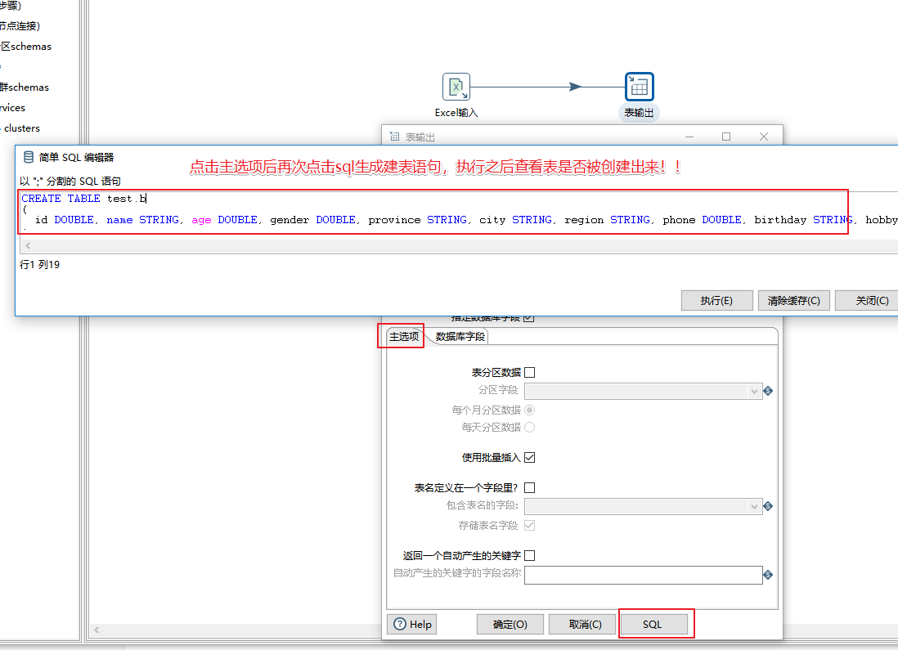 |
| 验证                                                        |
| 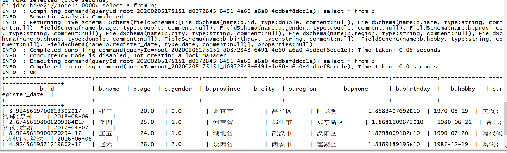 |


#### 执行Hive的HiveSQL语句

Kettle中可以执行Hive的HiveSQL语句，使用作业的SQL脚本。

需求：

- 聚合查询weblogs表（以IP和年月分组统计的PV数据），同时建立一个新表保存查询数据。

**准备hive表**

在hive的test数据库下创建weblogs表：

```sql
 CREATE TABLE `weblogs`(                           
  `client_ip` string,                              
  `full_request_date` string,                      
  `day` string,                                    
  `month` string,                                  
  `month_num` int,                                 
  `year` string,                                   
  `hour` string,                                   
  `minute` string,                                 
  `second` string,                                 
  `timezone` string,                               
  `http_verb` string,                              
  `uri` string,                                    
  `http_status_code` string,                       
  `bytes_returned` string,                         
  `referrer` string,                               
  `user_agent` string) 
  row format delimited fields terminated by '\t' stored as textfile;
```

导入资料\资料\02.kettle测试数据\hive-weblogs\下的数据

```shell
load data local inpath '/root/weblogs_parse.txt' into table weblogs;
```

验证数据

```sql
select * from test.weblogs limit 5;
```


实现步骤：

1、设计如下作业组件结构

| 设计如下作业组件结构                                        |
| ----------------------------------------------------------- |
| 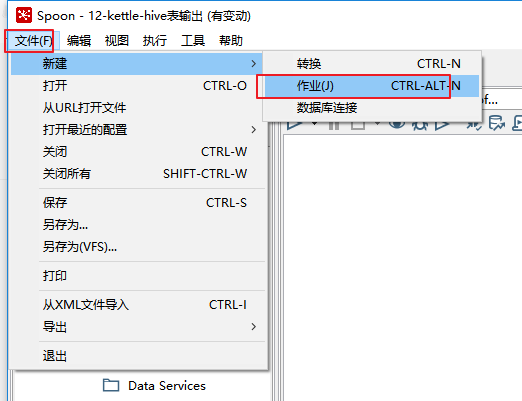 |
| 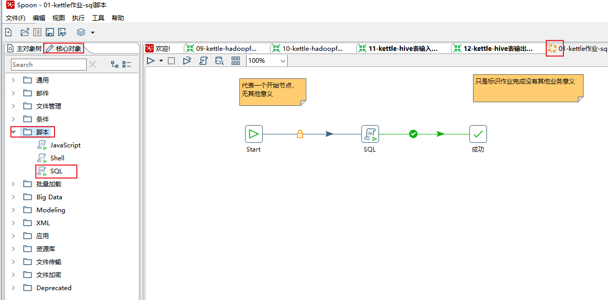 |
| 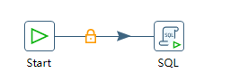                               |


2、配置SQL组件

| 配置sql组件                                                  |
| ------------------------------------------------------------ |
| 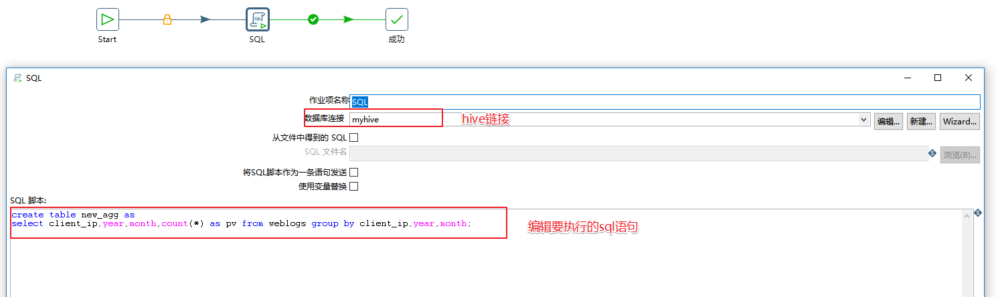  |
|  |


3、测试数据是否生成

| 验证数据                                                    |
| ----------------------------------------------------------- |
|  |

