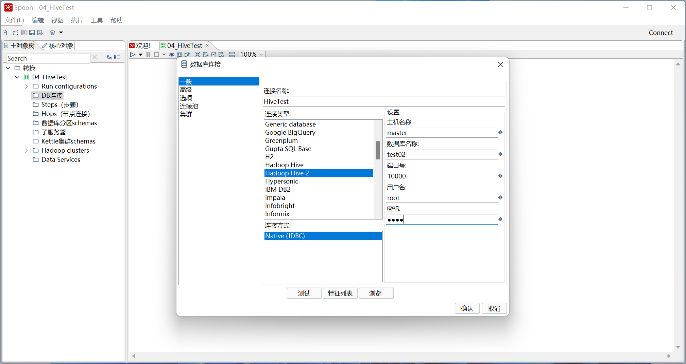

## Kettle整合大数据平台

### 整合Hadoop

1. 确保Hadoop的环境变量设置好HADOOP_USER_NAME为root

```shell
vi /etc/profile

HADOOP_USER_NAME=root
```

2. 从hadoop下载核心配置文件

   /software/hadoop/etc/hadoop/目录下的

   hdfs-site.xml和core-site.xml

3. 把hadoop核心配置文件(hdfs-site.xml和core-site.xml)放入kettle目录

```shell
data-integration\plugins\pentaho-big-data-plugin\hadoop-configurations\hdp30
```

4. 修改 `data-integration\plugins\pentaho-big-data-plugin\plugin.properties`文件

- 修改plugin.properties

```properties
active.hadoop.configuration=hdp
```

### 整合Hive

1、从虚拟机下载Hadoop的jar包

/software/hadoop/share/hadoop/common/

2、把jar包放在\data-integration\lib目录下，xml文件放到hdp30下





